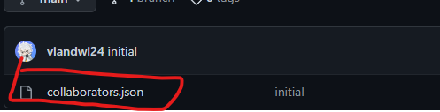
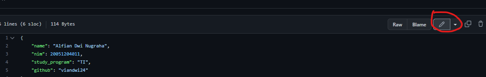
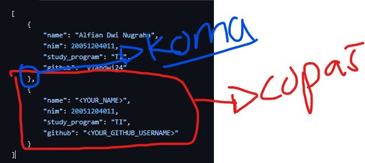
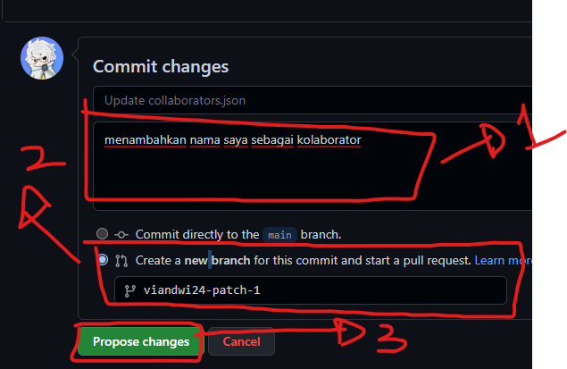
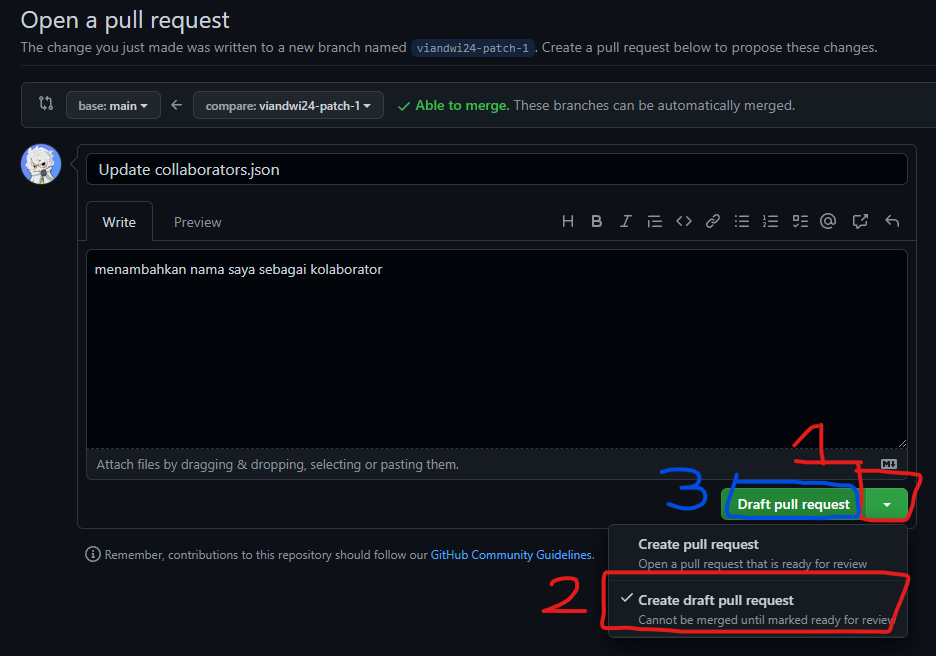
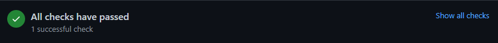
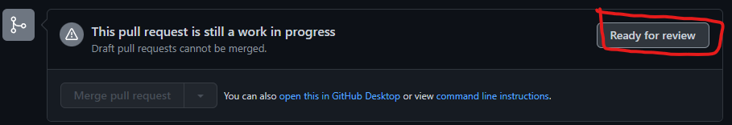

# HIMTI UNESA 2020 COLLABORATORS

Hanya repositori yang memberikan list kolaborator organisasi github ini.

## CARA MENJADI KOLABORATOR

1. Klik file "collaborators.json". Atau klik link berikut untuk langsung [edit file collaborators.json](https://github.com/himtiunesa2020/collaborators/edit/main/collaborators.json)

   
2. Klik "edit"

   
3. Copy block berikut, lalu ganti sesuaikan identitas mu

   
4. Lalu jika sudah mengisi, pergi ke bawah halaman, pilih "create pull request" lalu isikan deskripsinya dan klik "propose change"

   
5. Terakhir ganti ke "draft pull request" lalu klik kembali tombol "create draft pull request"

   
6. Tunggu beberapa saat (~1menit). Pastikan jendela Check ini berubah menjadi menunjukan tulisan "All checks have passed". jika tidak artinya ada kesalahan tulisan, kurang huruf koma atau yang lainnya saat melakukan edit.

   
7. Jika jendela pull request muncul, klik "ready for review". lalu selamat, anda tinggal menunggu para kolaborator lainnya menyetujui.
   
